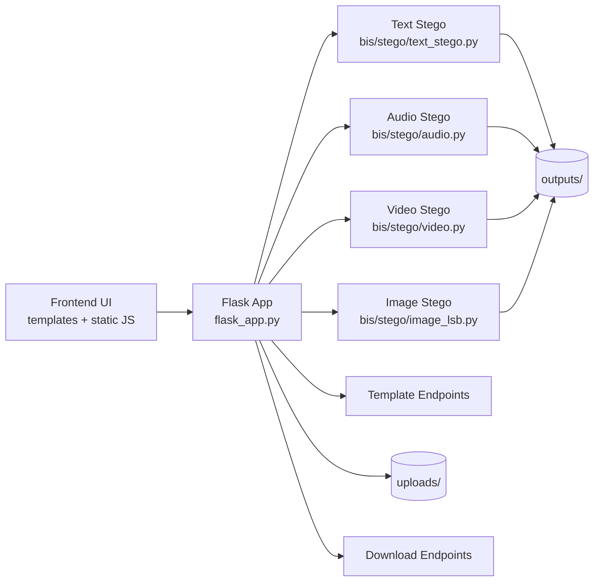

# Steganography (BIS Stagno)


Secure multi-media steganography web application built with Flask.

This project hides secret text inside text, audio, video, and images with optional password-based AES-GCM encryption.

## Table of Contents

- [Overview](#overview)
- [Demo and Media](#demo-and-media)
- [Core Capabilities](#core-capabilities)
- [End-to-End Workflow](#end-to-end-workflow)
- [Architecture](#architecture)
- [Template Gallery](#template-gallery)
- [Tech Stack](#tech-stack)
- [Project Structure](#project-structure)
- [Requirements](#requirements)
- [Quick Start](#quick-start)
- [Run the App](#run-the-app)
- [API Reference](#api-reference)
- [API Examples](#api-examples)
- [Quality Checkpoints](#quality-checkpoints)
- [Security Notes](#security-notes)
- [Fine-Tuning Module (Optional)](#fine-tuning-module-optional)
- [Troubleshooting](#troubleshooting)
- [Repository Notes](#repository-notes)
- [Contributing](#contributing)
- [License](#license)

## Overview

The application provides an end-to-end interface for steganography:

- Encrypt secret content into cover media
- Decrypt and recover hidden content
- Use built-in templates for fast testing
- Optionally encrypt hidden payloads with AES-GCM

The active runtime flow uses deterministic steganography pipelines in the `bis/stego` package.

## Demo and Media

Project output preview:


Full output video:

- [Watch Video.mp4](Video.mp4)

## Core Capabilities

- Text in Text via zero-width Unicode embedding
- Text in Audio via WAV least-significant-bit embedding
- Text in Video via frame-based embedding
- Text in Image via LSB embedding
- Template-generated covers for text, audio, video, and images
- Optional password-based AES-GCM encryption
- Optional fine-tuning dashboard and API routes

## End-to-End Workflow

1. User enters secret text and optional password.
2. User chooses a steganography mode.
3. User selects a template or uploads custom media.
4. Flask route calls the corresponding `bis/stego` module.
5. Output is generated and served as downloadable media.
6. Decrypt flow recovers and optionally decrypts payload.

## Architecture



## Template Gallery

Template previews used by the app:

<p align="center">
	
	
	
</p>
<p align="center">
	
	
	
</p>

## Tech Stack

- Backend: Flask, NumPy, OpenCV
- Security: PyCryptodome (AES-GCM)
- Frontend: HTML, CSS, JavaScript
- Media: WAV and video processing, optional ffmpeg for muxing

## Project Structure

```text
Stagno/
├── flask_app.py
├── pyproject.toml
├── requirements_local.txt
├── bis/
│   ├── stego/
│   │   ├── text_stego.py
│   │   ├── audio.py
│   │   ├── video.py
│   │   └── image_lsb.py
│   ├── utils/
│   ├── fine_tuning/
│   └── generation/image_gen/
├── static/
├── templates/
├── uploads/        (runtime, git ignored)
├── outputs/        (runtime, git ignored)
└── docs/images/
```

## Requirements

- Python 3.10+
- pip
- Optional: ffmpeg (recommended for richer video/audio workflows)
- Optional: Node.js (for frontend syntax checks)

## Quick Start

1. Clone repository.

```powershell
git clone https://github.com/VatsalOza11718/Steganography.git
cd Steganography
```

2. Create and activate a virtual environment.

```powershell
python -m venv .venv
.venv\Scripts\Activate.ps1
```

3. Install dependencies.

```powershell
pip install -e .
```

## Run the App

```powershell
python flask_app.py
```

Open in browser:

- http://127.0.0.1:5000

## API Reference

| Method | Endpoint | Content-Type | Purpose |
|---|---|---|---|
| GET | `/` | text/html | Home page |
| GET | `/encrypt` | text/html | Encrypt UI |
| GET | `/decrypt` | text/html | Decrypt UI |
| GET | `/about` | text/html | About page |
| POST | `/api/encrypt-text` | application/json | Hide secret in cover text |
| POST | `/api/decrypt-text` | application/json | Extract secret from stego text |
| POST | `/api/encrypt-audio` | multipart/form-data | Hide secret in WAV audio |
| POST | `/api/decrypt-audio` | multipart/form-data | Extract secret from stego audio |
| POST | `/api/encrypt-video` | multipart/form-data | Hide secret in video |
| POST | `/api/decrypt-video` | multipart/form-data | Extract secret from stego video |
| POST | `/api/encrypt-image` | multipart/form-data | Hide secret in image |
| POST | `/api/decrypt-image` | multipart/form-data | Extract secret from image |
| GET | `/api/templates/text/<template_id>` | application/json | Fetch text template |
| GET | `/api/templates/audio/<template_id>` | audio/wav | Generate audio template |
| GET | `/api/templates/video/<template_id>` | video/x-msvideo | Generate video template |
| GET | `/api/templates/image/<template_id>` | image/png | Fetch image template |
| GET | `/output/<filename>` | mixed | Serve output file |
| GET | `/api/download/<filename>` | mixed | Download output file |

## API Examples

Encrypt text:

```bash
curl -X POST http://127.0.0.1:5000/api/encrypt-text \
	-H "Content-Type: application/json" \
	-d '{"cover_text":"Normal message","secret_text":"Hidden text","password":"optional-pass"}'
```

Decrypt text:

```bash
curl -X POST http://127.0.0.1:5000/api/decrypt-text \
	-H "Content-Type: application/json" \
	-d '{"stego_text":"...","password":"optional-pass"}'
```

Encrypt audio:

```bash
curl -X POST http://127.0.0.1:5000/api/encrypt-audio \
	-F "text=hidden payload" \
	-F "password=optional-pass" \
	-F "audio=@cover.wav"
```

Encrypt video:

```bash
curl -X POST http://127.0.0.1:5000/api/encrypt-video \
	-F "text=hidden payload" \
	-F "password=optional-pass" \
	-F "video=@cover.mp4"
```

Encrypt image:

```bash
curl -X POST http://127.0.0.1:5000/api/encrypt-image \
	-F "secret_text=hidden payload" \
	-F "password=optional-pass" \
	-F "cover_image=@cover.png"
```

## Quality Checkpoints

Run these commands before release or push:

```powershell
python -m py_compile flask_app.py
Get-ChildItem -Recurse -Filter *.py | ForEach-Object { python -m py_compile $_.FullName }

node --check static/encrypt.js
node --check static/decrypt.js
node --check static/home.js
node --check static/shared.js
node --check static/animations.js
```

Smoke test:

```powershell
python -c "from flask_app import app; c=app.test_client(); assert c.get('/').status_code==200; assert c.get('/encrypt').status_code==200; assert c.get('/decrypt').status_code==200; assert c.get('/about').status_code==200; print('smoke-ok')"
```

## Security Notes

- Steganography conceals data existence, but encryption protects data confidentiality.
- Use strong passwords for sensitive payloads.
- Do not assume stego files are tamper-proof after heavy recompression.
- Treat outputs as sensitive artifacts and share only when required.

## Fine-Tuning Module (Optional)

Fine-tuning routes are conditionally registered when module dependencies are available.

- `POST /api/fine-tune/<modality>`
- `GET /api/fine-tune/status/<job_id>`
- `GET /fine-tune/dashboard`

## Troubleshooting

| Problem | Likely Cause | Fix |
|---|---|---|
| `ffmpeg` not found | Not installed or not on PATH | Install ffmpeg or add to PATH |
| Cannot decode output | Wrong password or modified media | Retry with original file and correct password |
| Slow video processing | Large video files or high resolution | Start with shorter/lower-resolution media |
| Import/module errors | Incomplete environment setup | Recreate venv and reinstall dependencies |

## Repository Notes

- Runtime artifacts are excluded by `.gitignore`.
- Legacy generation runtime paths and old unused generation modules were removed from active app flow.
- Current CLI entry point in packaging is `bis.fine_tuning.cli:main`.

## Contributing

1. Create a feature branch.
2. Implement and test changes.
3. Run all checkpoints listed above.
4. Open a pull request with a concise description.

## License

License file is not included yet. Add a `LICENSE` file before public reuse distribution.
