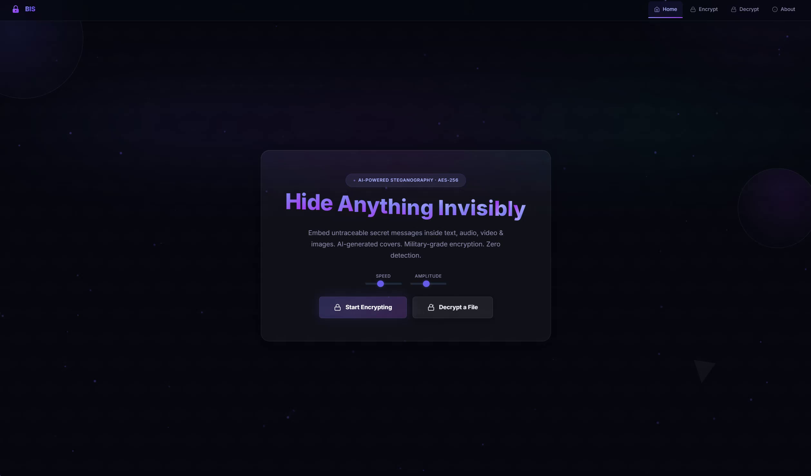
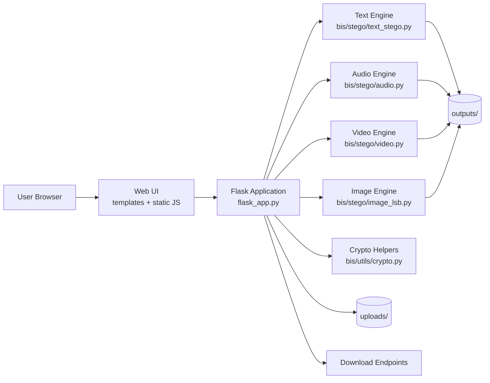
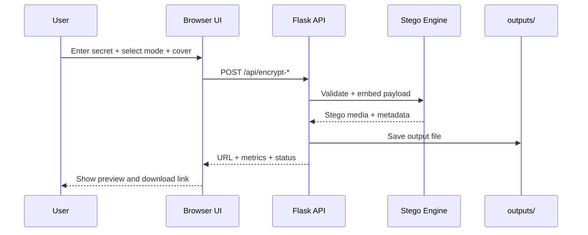
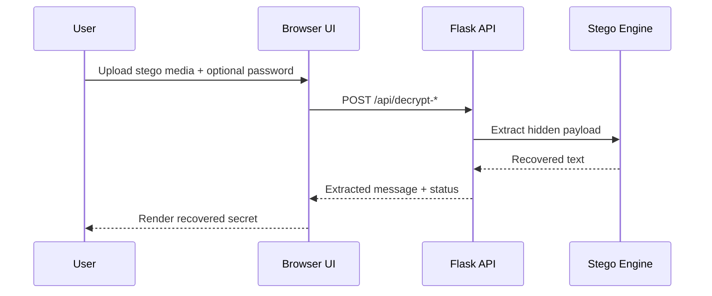
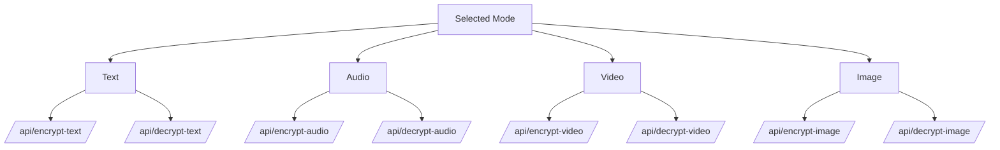

# BIS Stagno


Professional, web-based multi-modal steganography platform built with Flask.

This project is focused on browser-first encryption and decryption workflows (not CLI-first), and it supports all major steganography modes: text, audio, video, and image.

## Table of Contents

- [Executive Summary](#executive-summary)
- [Demo and Media](#demo-and-media)
- [Web-First Positioning](#web-first-positioning)
- [Steganography Coverage](#steganography-coverage)
- [System Diagrams](#system-diagrams)
- [Architecture and Components](#architecture-and-components)
- [Template Gallery](#template-gallery)
- [Technology Stack](#technology-stack)
- [Repository Structure](#repository-structure)
- [Getting Started](#getting-started)
- [Run the Web Application](#run-the-web-application)
- [API Reference](#api-reference)
- [API Usage Examples](#api-usage-examples)
- [Quality Checkpoints](#quality-checkpoints)
- [Security Considerations](#security-considerations)
- [Fine-Tuning Module (Optional)](#fine-tuning-module-optional)
- [Troubleshooting](#troubleshooting)
- [Repository Notes](#repository-notes)
- [Contributing](#contributing)
- [License](#license)

## Executive Summary

BIS Stagno provides a complete web interface for secure steganography operations:

- Hide secret messages inside text, audio, video, and image cover media
- Recover hidden messages through dedicated decrypt workflows
- Optionally protect payloads with AES-GCM encryption
- Use template-based covers for fast, reproducible testing
- Serve outputs as downloadable media files through web endpoints

The active runtime flow uses deterministic steganography implementations in `bis/stego`.

## Demo and Media

Project output preview:



Demo video:

- [Watch Video.mp4](Video.mp4)

## Web-First Positioning

This repository is designed as a web application first.

- Primary usage is through browser pages (`/`, `/encrypt`, `/decrypt`, `/about`)
- Frontend pages invoke backend APIs for all processing operations
- Upload and download flows are handled via web forms and HTTP endpoints
- Optional CLI entry points are secondary utilities for advanced modules

## Steganography Coverage

The project is not image-only. It supports all core steganography modes.

| Mode | Cover Type | Method | Encrypt | Decrypt |
|---|---|---|---|---|
| Text in Text | Plain text | Zero-width Unicode embedding | `/api/encrypt-text` | `/api/decrypt-text` |
| Text in Audio | WAV audio | LSB over audio samples | `/api/encrypt-audio` | `/api/decrypt-audio` |
| Text in Video | Video frames | Frame-level LSB embedding | `/api/encrypt-video` | `/api/decrypt-video` |
| Text in Image | PNG/JPG image | Pixel-level LSB embedding | `/api/encrypt-image` | `/api/decrypt-image` |

## System Diagrams

### 1. High-Level Web Architecture



### 2. Encrypt Request Sequence



### 3. Decrypt Request Sequence



### 4. Mode Routing Map



## Architecture and Components

| Layer | Main Files | Responsibility |
|---|---|---|
| Web UI | `templates/*`, `static/*` | User interactions, forms, client logic |
| Web API | `flask_app.py` | Routing, validation, orchestration |
| Stego Core | `bis/stego/*` | Embedding and extraction implementations |
| Utilities | `bis/utils/*` | Crypto, metrics, helper functions |
| Optional Training | `bis/fine_tuning/*` | Fine-tuning APIs and dashboard |

## Template Gallery

Template previews used in the web app:

<p align="center">
	
	
	
</p>
<p align="center">
	
	
	
</p>

## Technology Stack

- Backend: Flask, NumPy, OpenCV
- Security: PyCryptodome (AES-GCM)
- Frontend: HTML, CSS, JavaScript
- Media: WAV and video processing, optional ffmpeg muxing support

## Repository Structure

```text
Stagno/
├── flask_app.py
├── pyproject.toml
├── requirements_local.txt
├── bis/
│   ├── stego/
│   │   ├── text_stego.py
│   │   ├── audio.py
│   │   ├── video.py
│   │   └── image_lsb.py
│   ├── utils/
│   ├── fine_tuning/
│   └── generation/image_gen/
├── templates/
├── static/
├── uploads/          (runtime, git ignored)
├── outputs/          (runtime, git ignored)
├── docs/images/
└── Video.mp4
```

## Getting Started

### Prerequisites

- Python 3.10+
- pip
- Optional: ffmpeg (recommended for full video/audio workflows)
- Optional: Node.js (used for frontend syntax checks)

### Setup

```powershell
git clone https://github.com/VatsalOza11718/Steganography.git
cd Steganography

python -m venv .venv
.venv\Scripts\Activate.ps1

pip install -e .
```

## Run the Web Application

```powershell
python flask_app.py
```

Open:

- http://127.0.0.1:5000

## API Reference

| Method | Endpoint | Content-Type | Description |
|---|---|---|---|
| GET | `/` | text/html | Home page |
| GET | `/encrypt` | text/html | Encrypt web page |
| GET | `/decrypt` | text/html | Decrypt web page |
| GET | `/about` | text/html | About web page |
| POST | `/api/encrypt-text` | application/json | Encrypt payload into text cover |
| POST | `/api/decrypt-text` | application/json | Decrypt payload from text cover |
| POST | `/api/encrypt-audio` | multipart/form-data | Encrypt payload into WAV cover |
| POST | `/api/decrypt-audio` | multipart/form-data | Decrypt payload from WAV stego |
| POST | `/api/encrypt-video` | multipart/form-data | Encrypt payload into video cover |
| POST | `/api/decrypt-video` | multipart/form-data | Decrypt payload from video stego |
| POST | `/api/encrypt-image` | multipart/form-data | Encrypt payload into image cover |
| POST | `/api/decrypt-image` | multipart/form-data | Decrypt payload from image stego |
| GET | `/api/templates/text/<template_id>` | application/json | Fetch text template |
| GET | `/api/templates/audio/<template_id>` | audio/wav | Generate/fetch audio template |
| GET | `/api/templates/video/<template_id>` | video/x-msvideo | Generate/fetch video template |
| GET | `/api/templates/image/<template_id>` | image/png | Fetch image template |
| GET | `/output/<filename>` | mixed | Serve output artifact |
| GET | `/api/download/<filename>` | mixed | Download output artifact |

## API Usage Examples

### Encrypt text

```bash
curl -X POST http://127.0.0.1:5000/api/encrypt-text \
	-H "Content-Type: application/json" \
	-d '{"cover_text":"Normal message","secret_text":"Hidden text","password":"optional-pass"}'
```

### Decrypt text

```bash
curl -X POST http://127.0.0.1:5000/api/decrypt-text \
	-H "Content-Type: application/json" \
	-d '{"stego_text":"...","password":"optional-pass"}'
```

### Encrypt audio

```bash
curl -X POST http://127.0.0.1:5000/api/encrypt-audio \
	-F "text=hidden payload" \
	-F "password=optional-pass" \
	-F "audio=@cover.wav"
```

### Encrypt video

```bash
curl -X POST http://127.0.0.1:5000/api/encrypt-video \
	-F "text=hidden payload" \
	-F "password=optional-pass" \
	-F "video=@cover.mp4"
```

### Encrypt image

```bash
curl -X POST http://127.0.0.1:5000/api/encrypt-image \
	-F "secret_text=hidden payload" \
	-F "password=optional-pass" \
	-F "cover_image=@cover.png"
```

## Quality Checkpoints

Run before release/push:

```powershell
python -m py_compile flask_app.py
Get-ChildItem -Recurse -Filter *.py | ForEach-Object { python -m py_compile $_.FullName }

node --check static/encrypt.js
node --check static/decrypt.js
node --check static/home.js
node --check static/shared.js
node --check static/animations.js
```

Smoke test:

```powershell
python -c "from flask_app import app; c=app.test_client(); assert c.get('/').status_code==200; assert c.get('/encrypt').status_code==200; assert c.get('/decrypt').status_code==200; assert c.get('/about').status_code==200; print('smoke-ok')"
```

## Security Considerations

- Steganography hides the existence of data; encryption protects data confidentiality.
- Use strong passwords when AES-GCM is enabled.
- Treat generated outputs as sensitive artifacts.
- Recompression and heavy post-processing can reduce extraction reliability.

## Fine-Tuning Module (Optional)

Fine-tuning routes are conditionally registered when dependencies are available.

- `POST /api/fine-tune/<modality>`
- `GET /api/fine-tune/status/<job_id>`
- `GET /fine-tune/dashboard`

## Troubleshooting

| Problem | Likely Cause | Resolution |
|---|---|---|
| `ffmpeg` not found | Not installed or not on PATH | Install ffmpeg and add it to PATH |
| Cannot decode output | Wrong password or modified media | Use original output media and correct password |
| Slow processing on large media | High resolution/long duration input | Start with smaller input files |
| Module import errors | Incomplete environment | Recreate virtual environment and reinstall deps |

## Repository Notes

- Runtime artifacts are excluded via `.gitignore`.
- Legacy generation runtime paths and unused modules were removed from active flow.
- Web application flow is primary; optional CLI utilities are secondary.

## Contributing

1. Create a feature branch.
2. Implement and test your changes.
3. Run the quality checkpoints.
4. Open a pull request with a clear summary.

## License

A `LICENSE` file is not added yet. Add one before public reuse distribution.
